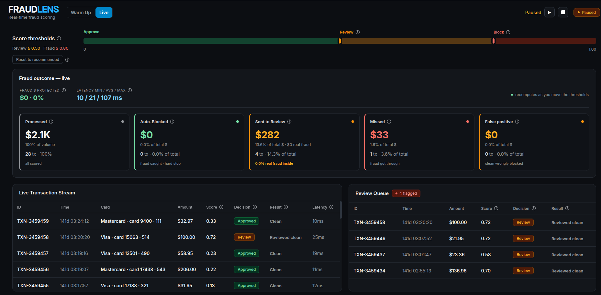

<!--
Copyright © Advanced Micro Devices, Inc., or its affiliates.

SPDX-License-Identifier: MIT
-->

# Fintech Fraud Detection

## Overview



This blueprint demonstrates a real-time financial transaction fraud detection system running on AMD GPUs in Kubernetes. It combines a Graph Neural Network (GNN) and an XGBoost ensemble with a deterministic rules engine to score transactions and classify them as legitimate, requiring review, or fraudulent. A streaming demo UI replays a prepared transaction dataset in the browser at configurable speed, showing live fraud decisions, metrics, and financial impact totals.

The system is trained and evaluated on the [IEEE-CIS Fraud Detection dataset](https://www.kaggle.com/competitions/ieee-fraud-detection/data) (590,540 transactions with a temporal 80/20 train/validation split by `TransactionDT`).

AMD Solution Blueprints are packaged as [helm charts](https://helm.sh/) for deployment on a Kubernetes cluster. For development or further exploration, the source code is public and available in the [Solution Blueprints GitHub repository](https://github.com/amd-enterprise-ai/solution-blueprints/tree/main/solution-blueprints/fintech-fraud-detection).

## Architecture

<picture>
  <source media="(prefers-color-scheme: light)" srcset="architecture-diagram-light-scheme.png">
  <source media="(prefers-color-scheme: dark)" srcset="architecture-diagram-dark-scheme.png">
  
</picture>

External traffic reaches the middleware on port 8080 via `kubectl port-forward` or a Gateway API HTTPRoute (when `http_route.enabled=true`).

### Components

| Component | Folder | Role |
|---|---|---|
| **GNN Service** | `backend/gnn/` | BentoML service running on AMD GPU. Accepts raw transaction features and graph edge context, returns fraud logits and embeddings. Exposed at `:3000`. |
| **XGBoost Service** | `backend/xgb/` | BentoML service running on AMD GPU. Accepts raw features and GNN embeddings, returns calibrated fraud probabilities. Exposed at `:3001`. |
| **Backend Orchestrator** | `backend/` | FastAPI service. Runs the rules engine first, then dispatches to GNN and/or XGBoost depending on the scoring mode. Exposes `GET /health`, `POST /score`, `POST /score/batch`. Runs at `:8000`. |
| **Middleware** | `middleware/` | FastAPI service. Downloads and holds the transaction dataset in memory, streams scored rows to the browser via Server-Sent Events, and exposes stream control endpoints (start/pause/stop). Runs at `:8080`. |
| **Frontend** | `frontend/` | React + TypeScript UI built with Vite, served as static files from the middleware container. Shows a live transaction feed, per-rule breakdowns, and financial impact metrics. |

### Key Features

- **GNN + XGBoost ensemble** — the GNN extracts graph-structural embeddings derived from card number and email domain relationships, which feed XGBoost as additional features. This improves detection of coordinated fraud patterns that look legitimate in isolation.
- **Deterministic rules engine** — rules R005–R024 cover duplicate transactions (BLOCK), card testing sequences (BLOCK), anomalous amounts (REVIEW), new device and large amount combinations (REVIEW), country changes (REVIEW), unusual hours (REVIEW), many recipients (REVIEW), amount splitting (MONITOR), round amounts (MONITOR), new accounts (MONITOR), frequent transactions (MONITOR), and unusual channels (MONITOR). Hard-block rules short-circuit ML scoring entirely.
- **Three scoring modes**: `xgb_ensemble` (GNN embeddings → XGBoost, highest accuracy), `gnn_only` (GNN direct softmax), `graph` (GNN with rolling neighbor context).
- **Live streaming demo** — the middleware replays the IEEE-CIS validation split at configurable speed; the frontend shows decisions, rule breakdowns, accuracy %, missed fraud USD, and false positive USD in real time.
- **Batch scoring** — the backend `/score/batch` endpoint accepts arrays of transactions for offline evaluation.
- **Configurable decision threshold** — transactions with `fraud_probability ≥ threshold` (default 0.5) are classified `FRAUD`; below threshold they are `NOT_FRAUD` (unless a rules engine hard-block fires first).

## Getting Started

This is a quick start guide on how to deploy the blueprint. For advanced options, such as providing a Hugging Face token, or overriding storage classes, see [Deploying Solution Blueprints with Helm](https://enterprise-ai.docs.amd.com/en/latest/solution-blueprints/deployment.html) or explore the [advanced deployment guide](./DEPLOYMENT.md).

### Prerequisites

- **Helm 3.x** and **kubectl** configured to reach the target cluster
- **Kubernetes cluster** with at least 2 AMD GPUs (ROCm 7.1.1+) and the AMD GPU device plugin installed
- A default **StorageClass** that can provision `ReadWriteOnce` volumes (9 Gi total across three PVCs)
- A **Hugging Face token** (Read access) — see [DEPLOYMENT.md](DEPLOYMENT.md#hugging-face-token) for the repositories to access and the Secret to create

#### System Requirements

This blueprint can be deployed on **AMD Instinct**. The blueprint requires the following cluster resources by default:

| Resource | Requirement |
|---|---|
| AMD GPUs | **2** (one for GNN service, one for XGBoost service) |
| GPU type | AMD ROCm-capable GPU (validated with ROCm 7.1.1) |
| Kubernetes | 1.26+ with the AMD GPU device plugin (`amd.com/gpu` resource) |
| CPU | 8+ cores recommended across all pods |
| Memory | 18+ Gi total (GNN: 8 Gi, XGB: 4 Gi, Backend: 4 Gi, Middleware: 2 Gi) |
| Storage | 9+ Gi across three PVCs (GNN artifacts: 4 Gi, XGB artifacts: 4 Gi, transaction data: 1 Gi) |
| StorageClass | A default StorageClass that supports `ReadWriteOnce` |
| Network | Outbound HTTPS to `huggingface.co` (initContainers download artifacts on first start) |

> The GNN and XGBoost services will not schedule without an AMD GPU. If GPUs are unavailable, remove the `amd.com/gpu: "1"` resource requests in `values.yaml` to allow CPU-only scheduling — inference will be significantly slower.

### Deployment

For advanced deployment options, explore the [advanced deployment guide](./DEPLOYMENT.md). Solution Blueprints are packaged as OCI-compliant Helm charts in the Docker Hub registry and can be deployed to a Kubernetes cluster with a single command. Define the `name` (deployment name) and the `namespace` (Kubernetes namespace), then pipe the output of `helm template` to `kubectl apply -f -`.

Find the deployment command below. Note: You can create a namespace using `kubectl create namespace <my-namespace>`.

This blueprint downloads its model artifacts and transaction data from Hugging Face at startup. Create the `hf-token` secret before deploying, see [DEPLOYMENT.md](DEPLOYMENT.md#hugging-face-token) for details.

```bash
name="my-deployment"
namespace="my-namespace"
kubectl create secret generic hf-token --from-literal=hf-token=<YOUR_HF_TOKEN> -n $namespace

helm template $name oci://registry-1.docker.io/amdenterpriseai/aimsb-fintech-fraud-detection \
  | kubectl apply -f - -n $namespace
```

### Verify Deployment

To check the status of the deployment, run:

```bash
kubectl get pods -n $namespace
```

Wait until all pods report `Running` and `Ready`.

### Connect to UI

To connect to the UI, port-forward to 8080. The UI is then available at [http://localhost:8080](http://localhost:8080) in your browser.

```bash
kubectl port-forward svc/$name-aimsb-fintech-fraud-detection-middleware 8080:8080 -n $namespace
```

### Clean Up

When you are finished, remove the deployed resources using the same deployment command, with `kubectl delete` instead of `kubectl apply`:

```bash
helm template $name oci://registry-1.docker.io/amdenterpriseai/aimsb-fintech-fraud-detection \
  | kubectl delete -f - -n $namespace
```

### Throughput and Latency

Measured on the reference cluster (AMD ROCm-capable GPU) via the `/score/batch` endpoint with 5 000 transactions from the IEEE-CIS dataset (3-run average):

| Mode | Throughput | Avg latency / tx | Notes |
|---|---|---|---|
| `gnn_only` | ~600 tx/s | ~1.7 ms | GNN softmax head only |
| `xgb_ensemble` | ~570 tx/s | ~1.7 ms | GNN embeddings → XGBoost; highest accuracy |

**Does the streaming UI affect throughput?** No. The live demo UI streams pre-scored rows from the middleware at a configurable replay rate (default 750 ms between rows) and calls the backend `/score` endpoint one transaction at a time on behalf of the stream. It runs independently of the `/score/batch` endpoint and does not compete for GPU resources at scale. For high-volume production use, send requests directly to `/score/batch` and ignore the streaming demo.

> These numbers were measured through a `kubectl port-forward` tunnel and include round-trip network overhead. Direct cluster-to-service throughput will be higher.

## Model Compatibility

For how the GNN and XGBoost models were trained and exported, see [Model Training](./DEPLOYMENT.md#model-training).

The GNN model requires a minimum capability level of **hidden channels ≥ 128 and embedding dimension ≥ 32** to produce meaningful fraud embeddings. The reference configuration uses `hidden_channels: 160` and `embed_dim: 64` (see `backend/config.yaml`).

Using a smaller or undertrained model degrades detection quality:

- A model trained for too few epochs may produce near-constant embeddings, causing XGBoost to rely only on raw features (equivalent to `gnn_only` mode but with no accuracy benefit from the ensemble).
- A model with mismatched architecture dimensions will fail at inference time with a shape mismatch error in the XGBoost feature vector.

The XGBoost model is trained on the combined feature set (raw transaction fields + GNN embeddings). It must be retrained whenever the GNN architecture changes.

## Configuration Options

### Scoring mode

The backend `/score` endpoint accepts a `mode` query parameter:

| Mode | Description |
|---|---|
| `xgb_ensemble` (default) | GNN extracts embeddings → XGBoost scores on raw features + embeddings |
| `gnn_only` | GNN softmax probability only, no XGBoost pass |
| `graph` | Like `gnn_only` but includes rolling neighbor graph context per transaction |

### Decision threshold

Configured in `backend/config.yaml` under `eval.threshold` (default `0.5`). The `CombinedPredictor` applies this threshold to `fraud_probability` when determining the `FRAUD` / `NOT_FRAUD` decision. Transactions matched by a hard-block rule always return `FRAUD` regardless of threshold.

### Stream speed and row cap

`middleware.streamIntervalMs` (default `750` ms) controls how fast transactions are replayed in the UI. `middleware.maxDemoRows` (default `20000`) caps how many rows are loaded into memory at startup. At 750 ms per row, 20,000 rows provides approximately 4 hours of continuous demo playback while keeping memory usage under 2 Gi.

### Model service URLs and tokens

When the chart deploys the GNN and XGBoost pods itself, `GNN_MODEL_URL` and `XGB_MODEL_URL` are wired automatically to the in-cluster services. When pointing to external services, set them explicitly via:

```
env_vars.backend.GNN_MODEL_URL
env_vars.backend.GNN_API_TOKEN
env_vars.backend.XGB_MODEL_URL
env_vars.backend.XGB_API_TOKEN
```

## Example Scenarios

### Live streaming demo

After deployment, port-forward to the middleware and open `http://localhost:8080` in a browser. Click **▶ Start** on the Live tab. Transactions from the IEEE-CIS validation split are replayed at ~750 ms each. The top panel shows a live feed with per-transaction decisions (`NOT_FRAUD` / `REVIEW` / `FRAUD`). The metrics panel accumulates accuracy %, missed fraud dollar value, and false positive dollar value as the stream runs.

Rule firings are shown alongside each transaction. For example, a transaction matching R005 (duplicate transaction ID) is blocked immediately without invoking GNN or XGBoost.

### Batch evaluation

```bash
# Requires port-forward to backend on :8000
curl -X POST http://localhost:8000/score/batch \
  -H "Content-Type: application/json" \
  -d '[{"TransactionAmt": 150.0, "card1": 12345}, {"TransactionAmt": 9.99}]'
```

Returns an array of score results, one per input transaction, each with `fraud_probability`, `decision`, and `rules_matched`.

### Scoring a single transaction

```bash
curl -X POST "http://localhost:8000/score?mode=xgb_ensemble" \
  -H "Content-Type: application/json" \
  -d '{"TransactionAmt": 5000.0, "card1": 99999, "addr1": 123}'
```

## Third-Party Components

| Component | License | Purpose |
|---|---|---|
| [BentoML](https://github.com/bentoml/BentoML) | Apache 2.0 | ML model serving framework for GNN and XGBoost inference services |
| [XGBoost](https://github.com/dmlc/xgboost) | Apache 2.0 | Gradient boosting library for the ensemble fraud classifier |
| [PyTorch Geometric](https://github.com/pyg-team/pytorch_geometric) | MIT | Graph neural network implementation |
| [PyTorch](https://github.com/pytorch/pytorch) | BSD-style | Deep learning backend for GNN training and inference |
| [FastAPI](https://github.com/fastapi/fastapi) | MIT | Web framework for the backend orchestrator and middleware |
| [React](https://github.com/facebook/react) | MIT | Frontend UI framework |
| [HuggingFace Hub](https://github.com/huggingface/huggingface_hub) | Apache 2.0 | Model and dataset artifact hosting and download |
| [IEEE-CIS Fraud Detection dataset](https://www.kaggle.com/competitions/ieee-fraud-detection/data) | Kaggle competition rules | Transaction data used for training and demo replay |

Use of the IEEE-CIS dataset is subject to the [Kaggle competition rules](https://www.kaggle.com/competitions/ieee-fraud-detection/rules). The dataset is not included in this repository and must be downloaded separately via HuggingFace Hub.

## Terms of Use

Copyright © Advanced Micro Devices, Inc., or its affiliates.

AMD Solution Blueprints are released under the [MIT License](https://opensource.org/license/mit), which governs the parts of the software and materials created by AMD. Third-party software and materials used within the Solution Blueprint are governed by their respective licenses.

This blueprint is provided for demonstration purposes. It is trained on the publicly available IEEE-CIS Fraud Detection dataset and is not intended for direct production deployment without further validation, bias assessment, and regulatory compliance review.
