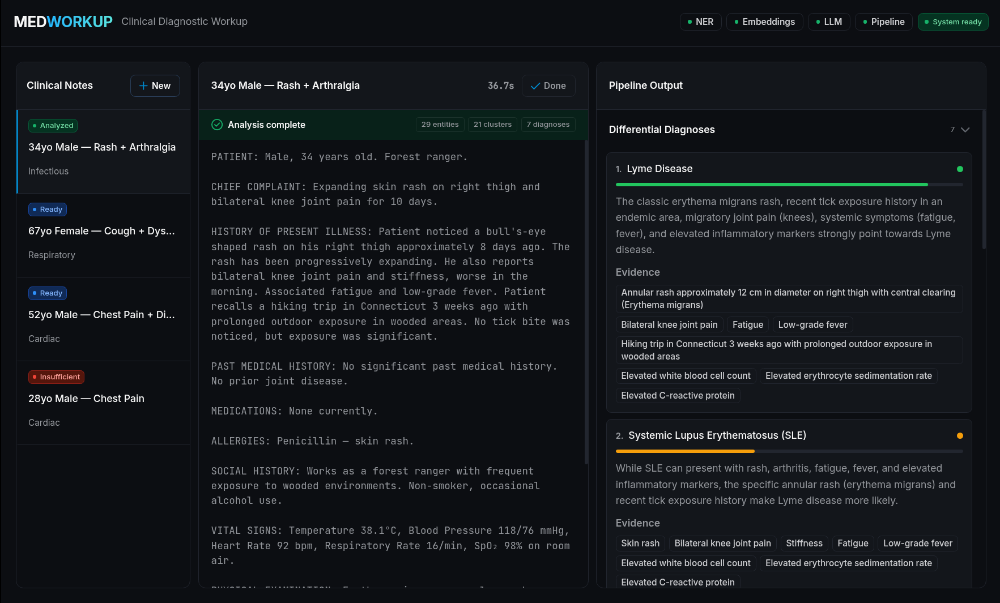

<!--
Copyright © Advanced Micro Devices, Inc., or its affiliates.

SPDX-License-Identifier: MIT
-->

# MedWorkUp — Clinical Diagnostic Assistant

## Overview



Clinical notes contain critical diagnostic information that, when processed
intelligently, can generate structured differential diagnoses to support
clinical decision-making.

This blueprint presents a nine-step NLP pipeline that processes raw clinical (SOAP format) notes through:

1. **Preprocessing** — SOAP section detection, negation handling, abbreviation expansion
2. **Named Entity Recognition** — Parallel GLiNER biomedical NER and MedCAT concept linking
3. **Entity Aggregation** — Span merging, deduplication, and normalization
4. **Semantic Embeddings** — SapBERT cosine-similarity clustering of clinical entities
5. **Categorization** — LLM-based classification of entities into symptoms / diseases / findings
6. **Candidate Generation** — Differential diagnosis candidate list via LLM reasoning
7. **Evidence Reasoning** — Constrained chain-of-thought reasoning grounded in extracted evidence
8. **Ranking** — Score-based sorting and confidence filtering
9. **Consistency Check** — Cross-verification and diagnosis adjustment via LLM

AMD Solution Blueprints are packaged as [helm charts](https://helm.sh/) for deployment on a Kubernetes cluster. For development or further exploration, the source code is public and available in the [Solution Blueprints GitHub repository](https://github.com/amd-enterprise-ai/solution-blueprints/tree/main/solution-blueprints/medworkup).

## Architecture

<picture>
  <source media="(prefers-color-scheme: light)" srcset="architecture-diagram-light-scheme.png">
  <source media="(prefers-color-scheme: dark)" srcset="architecture-diagram-dark-scheme.png">
  
</picture>

Requests flow from the browser UI to the orchestrator, which drives the nine-step pipeline across the NER, embedding, MedCAT, and MedGemma services over internal cluster DNS:

```
Browser → http://localhost:8080 (UI / nginx)
              │
              └─► orchestrator:8003  (FastAPI NLP pipeline)
                      ├─► ner-service:8001        (GLiNER NER)
                      ├─► embedding-service:8002  (SapBERT embeddings)
                      ├─► medcat-service:8004      (MedCAT NER+L)
                      └─► medgemma:80               (MedGemma 27B LLM, via the aimchart-llm subchart)
```

MedWorkUp is composed of six services:

| Component | Port | Role |
|---------|------|-------------|
| **UI** | 8080 | nginx reverse proxy + React SPA. Primary user entry point. |
| **Orchestrator** | 8003 | FastAPI service that drives the 9-step NLP pipeline and exposes `/analyze`, `/health`, `/sys/health`, and `/pipeline` endpoints. |
| **NER Service** | 8001 | GLiNER biomedical named entity recognition. Supports ONNX mode (fast, offline) and HuggingFace mode (auto-download). |
| **Embedding Service** | 8002 | SapBERT biomedical embeddings for entity similarity clustering. Supports ONNX and HuggingFace modes. |
| **MedCAT Service** | 8004 | CogStack MedCAT NER+L REST API for UMLS/SNOMED concept linking. Uses pre-built `cogstacksystems/medcat-service` image. |
| **MedGemma** | 80 | MedGemma 27B multimodal LLM served via AMD AIM, deployed as the `aimchart-llm` subchart. Requires AMD GPU with ROCm. |

### Key Features

- Full control over your data and privacy — clinical notes are processed entirely within your own infrastructure, with no calls to external APIs
- Structured, evidence-grounded differential diagnoses produced from free-text SOAP notes
- Combines specialized biomedical models (GLiNER, SapBERT, MedCAT) with MedGemma 27B reasoning
- Transparent and inspectable — every pipeline stage and its evidence can be logged, debugged, and audited
- Offline-capable model loading via ONNX mode for air-gapped or regulated environments
- Suitable for regulated healthcare settings where cloud clinical NLP services are restricted or disallowed

## Getting Started

This is a quick start guide on how to deploy the blueprint. For advanced options — creating the required credential secrets, reusing storage, or enabling gateway access — see the [advanced deployment guide](./DEPLOYMENT.md).

### Prerequisites

#### System Requirements

This blueprint can be deployed on **AMD Instinct**. The blueprint requires the following cluster resources by default:

| Resource | Default Configuration |
|--|-------------------|
| GPUs | 1 (AMD Instinct, for MedGemma) |
| CPUs | 35 CPU cores |
| RAM | 243 GiB |

To deploy to the Kubernetes cluster, ensure the following prerequisites are met:

- [kubectl](https://kubernetes.io/docs/tasks/tools/): Installed and configured to communicate with the cluster
- [Helm](https://helm.sh/docs/intro/install/) 3.16 – 4.2.0: Installed on your local machine
- A **HuggingFace token** from an account that has accepted the MedGemma license (for the MedGemma model download — a token alone is not sufficient), and a **UMLS API key** (for MedCAT), provided as Kubernetes Secrets — see the [advanced deployment guide](./DEPLOYMENT.md#credentials)

### Deployment

For advanced deployment options, explore the [advanced deployment guide](./DEPLOYMENT.md). Solution Blueprints are packaged as OCI-compliant Helm charts in the Docker Hub registry and can be deployed to a Kubernetes cluster with a single command. After creating the required credential secrets, define the `name` (deployment name) and the `namespace` (Kubernetes namespace), then pipe the output of `helm template` to `kubectl apply -f -`:

```bash
name="my-deployment"
namespace="my-namespace"
helm template $name oci://registry-1.docker.io/amdenterpriseai/aimsb-medworkup \
  | kubectl apply -f - -n $namespace
```

Note: You can create a namespace using `kubectl create namespace $namespace`.

### Verify Deployment

To check the status of the deployment, run:

```bash
kubectl get pods -n $namespace
```

Wait until all pods report `Running` and `Ready`. On first run, MedCAT and MedGemma models are downloaded automatically and may take some time to become ready.

### Connect to UI

To connect to the UI, port-forward to port 8080. The UI will then be available at [http://localhost:8080](http://localhost:8080) in your browser.

```bash
kubectl port-forward services/$name-aimsb-medworkup-ui 8080:8080 -n $namespace
```

### Clean Up

When you are finished, remove the deployed resources using the same deployment command, with `kubectl delete` instead of `kubectl apply`:

```bash
helm template $name oci://registry-1.docker.io/amdenterpriseai/aimsb-medworkup \
  | kubectl delete -f - -n $namespace
```

## Pipeline API

The orchestrator exposes a JSON API:

### Request

```
POST /analyze
Content-Type: application/json

{
  "text": "Patient presents with fever, productive cough, and shortness of breath. SpO2 94%. CXR shows consolidation."
}
```

### Response

```json
{
  "diagnoses": [
    {
      "name": "Community-acquired pneumonia",
      "confidence": 0.87,
      "evidence": ["fever", "productive cough", "SpO2 94%", "CXR consolidation"],
      "reasoning": "..."
    }
  ],
  "entities_raw": [...],
  "entities_normalized": [...],
  "categorized_entities": { ... },
  "pipeline_meta": { ... }
}
```

### Health Endpoints

| Endpoint | Description |
|----------|-------------|
| `GET /health` | Fast liveness probe (no downstream calls) |
| `GET /sys/health` | Full system health — probes all downstream services concurrently |
| `GET /pipeline` | Describe pipeline stages and their service dependencies |
| `GET /docs` | Interactive Swagger UI |

## Model Loading Modes

The NER and Embedding services support two model loading modes:

### HuggingFace Mode (default)

Models are downloaded from HuggingFace Hub on first startup and cached in a
persistent volume. Requires `HUGGING_FACE_HUB_TOKEN`.

### ONNX Mode

Pre-downloaded model artifacts are mounted from a local directory. No network
access required at runtime. Faster startup.

Configure via `NER_ONNX_PATH` and `EMBEDDING_ONNX_PATH` environment variables
(see `values.yaml` or `.env.example`).

## Third-Party Components

This Solution Blueprint utilizes multiple components. For third-party license information, refer to each component's documentation. Key third-party components can be seen below:

| Component | License |
|---------|---------|
| MedGemma | [Health AI Developer Foundations Terms of Use](https://developers.google.com/health-ai-developer-foundations/terms) |
| MedCAT | Elastic License 2.0 |
| GLiNER-BioMed | Apache 2.0 |
| SapBERT | Apache 2.0 |
| FastAPI | MIT |
| React | MIT |
| nginx | BSD-2-Clause |

## Terms of Use

AMD Solution Blueprints are released under the [MIT License](https://opensource.org/license/mit), which governs the parts of the software and materials created by AMD. Third-party software and materials used within the Solution Blueprint are governed by their respective licenses.
