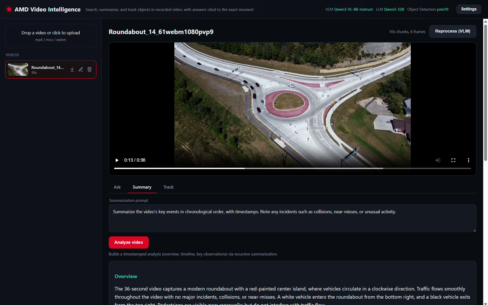
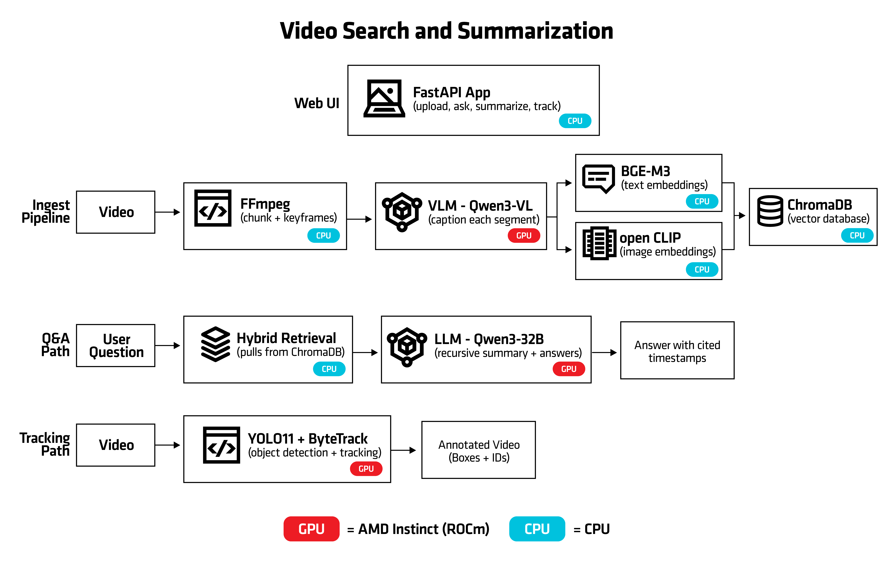

<!--
Copyright © Advanced Micro Devices, Inc., or its affiliates.

SPDX-License-Identifier: MIT
-->

# Video Search and Summarization

## Overview



Video Search and Summarization makes large archives of recorded video searchable in plain language and summarizes them, entirely on your own infrastructure. A vision-language model captions short video segments, embeddings power hybrid retrieval over a vector database, and a large language model produces recursive summaries and answers questions that cite the exact moment in the video. An object detection and tracking pipeline adds bounding boxes and persistent IDs on a tracking-overlay copy of the video. Everything runs on AMD Instinct GPUs (ROCm) using open-weight models, so your video data never leaves your environment.

The workflow is:

1. Upload a recorded video. It is split into fixed-length segments; the vision-language model captions each one, produces structured tags, and a keyframe is saved per segment.
2. Caption text and keyframe images are embedded and stored in a vector database.
3. The LLM recursively summarizes segments into scenes and a video-level summary.
4. Questions are answered by hybrid retrieval (caption text plus keyframe image similarity), and each answer cites the `(segment, timestamp)` it relied on. Q&A can span the whole archive.
5. Optionally, run object detection and multi-object tracking on a video to draw boxes and IDs and make the tracked objects queryable.

AMD Solution Blueprints are packaged as [helm charts](https://helm.sh/) for deployment on a Kubernetes cluster. For development or further exploration, the source code is public and available in the [solution-blueprints GitHub repository](https://github.com/amd-enterprise-ai/solution-blueprints/tree/main/solution-blueprints/video-search-and-summarization).

## Architecture

<picture>
  <source media="(prefers-color-scheme: light)" srcset="architecture-diagram-light-scheme.png">
  <source media="(prefers-color-scheme: dark)" srcset="architecture-diagram-dark-scheme.png">
  
</picture>

The blueprint integrates an application backend with a single-page UI and several model services. The vision-language model captions segments, the LLM produces summaries and grounded answers, text and image embeddings power hybrid retrieval in a vector database, and an object tracker adds detection and tracking overlays.

| Component | Role |
|-----------|------|
| Application + UI | FastAPI backend and single-page UI for upload, search, Q&A, summaries, and tracking |
| VLM (captioning) | Vision-language model that captions segments (default: Qwen3-VL-8B-Instruct) |
| LLM (summaries + answers) | AIM language model for recursive summaries and grounded answers (default: Qwen3-32B) |
| Text embeddings | Caption-text embeddings (BGE-M3), served by the embedding subchart (vLLM) |
| Image embeddings | Keyframe image embeddings (CLIP), served by the embedding subchart (vLLM) for hybrid retrieval |
| Vector database | ChromaDB store for captions and keyframe embeddings |
| Object detection + tracking | YOLO11 + ByteTrack tracker with on-video overlays |

### Key Features

- Grounded, timestamp-cited answers, with an honest "I don't know" when no segment supports an answer
- A single configurable domain prompt that cascades to captioning, summarization, and Q&A
- Archive-wide search across many videos
- Object detection and tracking with an on-video overlay and queryable tracked objects
- Configurable chunk length and keyframes-per-chunk
- Runs on-premises on AMD Instinct GPUs with open-weight models

## Getting Started

This is a quick start guide on how to deploy the blueprint. For advanced options, such as reusing an existing AIM or overriding storage classes, see [Deploying Solution Blueprints with Helm](https://enterprise-ai.docs.amd.com/en/latest/solution-blueprints/deployment.html) or explore the [advanced deployment guide](./DEPLOYMENT.md).

### Prerequisites

#### System Requirements

This blueprint can be deployed on **AMD Instinct**. The blueprint requires the following cluster resources by default:

| Resource | Default Configuration |
|--|-------------------|
| GPUs | 5 (vision-language model, LLM, two embedding models, and tracker) |
| CPUs | 54 CPU cores |
| RAM | 248 GiB RAM |

To deploy to the Kubernetes cluster, ensure the following prerequisites are met:

- [kubectl](https://kubernetes.io/docs/tasks/tools/): Installed and configured to communicate with the cluster
- [Helm](https://helm.sh/docs/intro/install/) 3.16 – 4.2.0: Installed on your local machine
- The AMD GPU device plugin (`amd.com/gpu`) available on GPU nodes

### Deployment

Solution Blueprints are packaged as OCI-compliant Helm charts in the Docker Hub registry and can be deployed to a Kubernetes cluster with a single command. Define the `name` (deployment name) and the `namespace` (Kubernetes namespace), then pipe the output of `helm template` to `kubectl apply -f -`:

```bash
name="my-deployment"
namespace="my-namespace"
helm template $name oci://registry-1.docker.io/amdenterpriseai/aimsb-video-search-and-summarization \
  | kubectl apply -f - -n $namespace
```

Note: You can create a namespace using `kubectl create namespace $namespace`

### Verify Deployment

To check the status of the deployment, run:

```bash
kubectl get pods -n $namespace
```

Wait until all pods report `Running` and `Ready`. The vision-language model and LLM can take several minutes to load on first start.

### Connect to UI

To connect to the UI, port-forward to any chosen port, e.g., 8090. The UI will then be available at [http://localhost:8090](http://localhost:8090) in your browser.

```bash
kubectl port-forward services/$name-aimsb-video-search-and-summarization 8090:80 -n $namespace
```

### Clean Up

When you are finished, remove the deployed resources:

```bash
helm template $name oci://registry-1.docker.io/amdenterpriseai/aimsb-video-search-and-summarization \
  | kubectl delete -f - -n $namespace
```

## Third-Party Components

This Solution Blueprint utilizes multiple components. For third-party license information, refer to each component's documentation. Key third-party components can be seen below:

| Component | License |
|---------|---------|
| vLLM | Apache 2.0 |
| ChromaDB | Apache 2.0 |
| Ultralytics YOLO11 | AGPL-3.0 |
| BGE-M3 | MIT |
| CLIP | MIT |

## Terms of Use

AMD Solution Blueprints are released under the [MIT License](https://opensource.org/license/mit), which governs the parts of the software and materials created by AMD. Third-party software and materials used within the Solution Blueprint are governed by their respective licenses.
